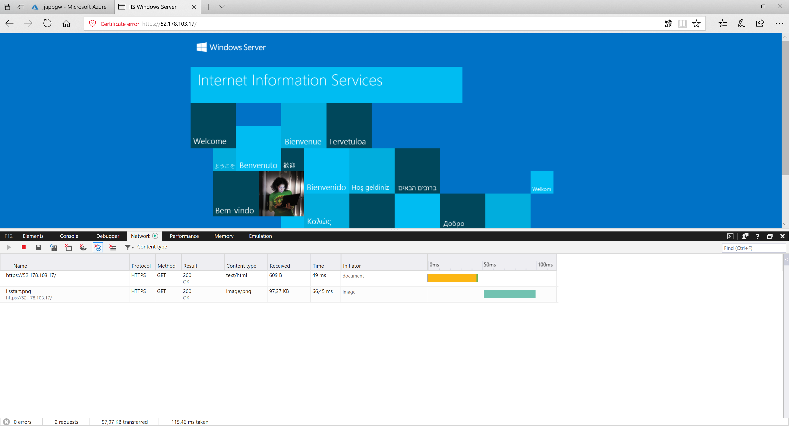

# JJ Azure Application Gateway and HTTP/2

## Deploy AppGW with HTTP/2
Use template to deploy Application Gateway.
Template is using certificate stored in certificates folder.

!!! Any changes not allowed in portal because of preview feature !!!

Export certificate to base-64
```powershell
[System.Convert]::ToBase64String([System.IO.File]::ReadAllBytes("appgw-http2\certificates\cert.pfx")) > "cert.txt"
```
[Sample template AppGw] https://github.com/Azure/azure-quickstart-templates/tree/master/201-application-gateway-2vms-iis-ssl

## Windows Virtual Machine with HTTP/2
Run Windows2016 server and configure it to enable http/2.
Http/2 is working only on TLS (https) connections.

[How to enable HTTP/2] https://msandbu.wordpress.com/2015/09/04/setting-up-http2-support-on-iis-server-2016-citrix-storefront/

Test https://localhost and check F12


Test in browser url running Azure VM


## Test Applicationn Gateway HTTP/2
Test in browser https://yourappgw


## Protocol gRPC
[Quickstart for c#] https://grpc.io/docs/quickstart/csharp.html