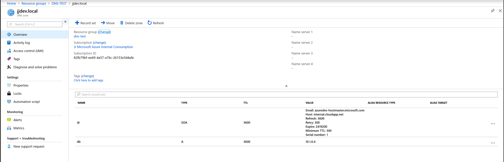
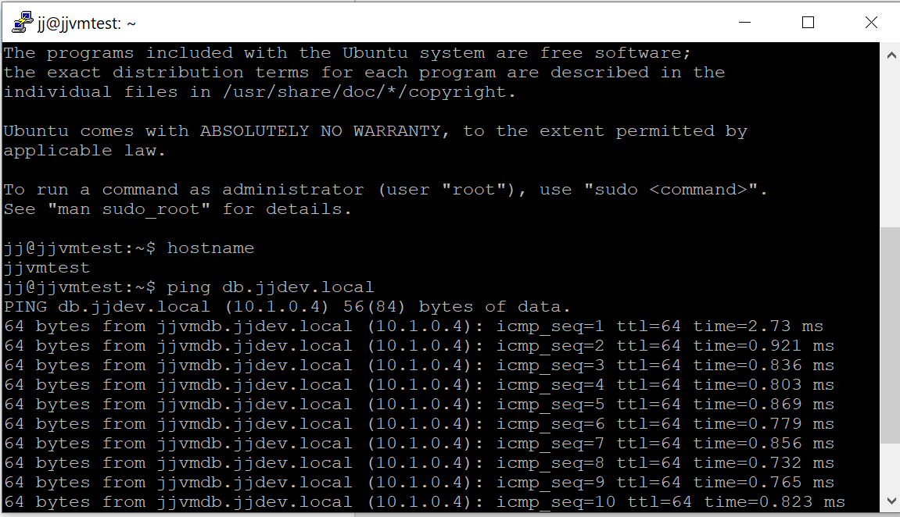

# Virtual Network with Azure DNS Private zone

## Deploy template with DNS

Template deploys Azure DNS privaaz vte zone with A record of db.jjdev.local

```bash
az group create -n DNS-TEST -l westeurope
az group deployment create -g DNS-TEST --template-file deploy-vnetdns.json --parameters deploy-vnetdns-params.json
```

## Deploy VM for tests

Deploy db.jjdev.local server in vnet

```bash
az group create -n DNS-TEST-VM -l westeurope
az vm create -g DNS-TEST-VM -n jjvmdb --image UbuntuLTS --size Standard_B1ms --subnet $(az network vnet subnet show -g DNS-TEST --vnet-name jjtestdns-vnet -n backend -o tsv --query id) --private-ip-address 10.1.0.4 --public-ip-address "" --authentication-type password --admin-username jj --admin-password Azure-1234567890 --no-wait
```

Deploy server to test DNS record

```bash
az vm create -g DNS-TEST-VM -n jjvmtest --image UbuntuLTS --size Standard_B1ms --subnet $(az network vnet subnet show -g DNS-TEST --vnet-name jjtestdns-vnet -n backend -o tsv --query id) --authentication-type password --admin-username jj --admin-password Azure-1234567890
```

Windows test VM

```bash
az vm create -g DNS-TEST-VM -n jjvmtestwin --image Win2016Datacenter --size Standard_B2ms --subnet $(az network vnet subnet show -g DNS-TEST --vnet-namejjtestdns-vnet -n backend -o tsv --query id) --authentication-type password --admin-username jj --admin-password Azure-1234567890
```

## Test private DNS name


