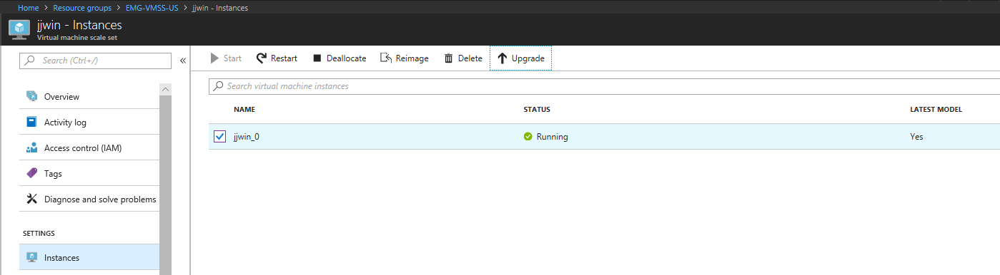

# VMSS with DSC extension to install custom app
This sample creates Azure Virtual Machine ScaleSet. VMSS is configured by DSC. DSC script is custom scipt located on Azure Storage.

Note: It's not using Azure Automation for DSC configurations.

How to integrate DSC in ARM template
https://docs.microsoft.com/en-us/azure/virtual-machine-scale-sets/virtual-machine-scale-sets-dsc

Alternative is to use Continuos Delivery on VMSS blade (it's in Preview stage).
It's simplyfied scripts management (stored on VSTS or GitHub) and configures deployment (via VSTS Release management).

## Prepare Azure
```bash
rg='JJ-VMSS'
az group create -n $rg -l westeurope
```

## Prepare Azure Storage with script
Provision new Azure Storage 

```bash
az storage account create -g $rg -n jjdscscripts --sku Standard_LRS
```
## Upload DSC script
Create new container and upload ZIP file (containing DSC script) from Azure portal
- Public Container: scripts

## Deploy
Start deployment with Azure CLI
```bash
az group deployment create -g $rg --template-file azure.deploy.json --parameters azure.parameters.json
```

## Updates
If you want to update app, change version and check if VMSS is running latest model. If no, click update.



