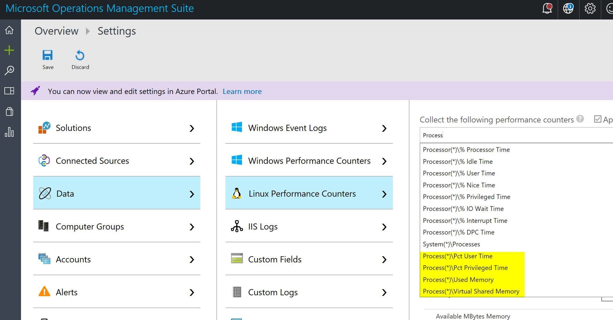

# Deploy a VM Scale Set of Windows VMs with a custom script extension

<a href="https://portal.azure.com/#create/Microsoft.Template/uri/https%3A%2F%2Fraw.githubusercontent.com%2Fjjindrich%2Fazure-templates%2Fmaster%2Fvmss-custom-script-linux%2Fazuredeploy.json" target="_blank">
    
</a>

This template allows you to deploy a VM Scale Set of Linux VMs with a custom script run on each VM. To connect from the load balancer to a VM in the scale set, you would go to the Azure Portal, find the load balancer of your scale set, examine the NAT rules, then connect using the NAT rule you want. For example, if there is a NAT rule on port 50000, you could SSH on port 50000 of the public IP to connect to that VM:

## Custom script for configuration
Sample custom script install Mindnight Commander and simple Docker container with web server.
You can try to access ssh session on ports beginning 50000. Web app is running on load balanced port 80.

If you want to manage Docker it's much easier use vmss-docker project or with <a href="https://docs.microsoft.com/en-us/azure/virtual-machines/linux/dockerextension">Azure Docker VM Extension</a>.

## Enabled monitoring
Template contains monitoring connected to OMS workspace (parameter OmsWorkspacename). You can monitor and analyse logs with log search.
More details about extension <a href="https://docs.microsoft.com/en-us/azure/log-analytics/log-analytics-azure-vm-extension">here</a>.

You can modify which data you want collect, e.g. collect data about processes


There are additional steps how to extend data collection via oms agent, see <a href="https://tomaskubica.cz/oms-jak-merit-vykon-cehokoli-v-linuxu/">link</a>

Query consumption for python3 process
``` 
 * InstanceName=python3 ObjectName=Process CounterName="Pct User Time"
```

PARAMETER RESTRICTIONS
======================

vmssName must be 3-61 characters in length. It should also be globally unique across all of Azure. If it isn't globally unique, it is possible that this template will still deploy properly, but we don't recommend relying on this pseudo-probabilistic behavior.
instanceCount must be 100 or less.