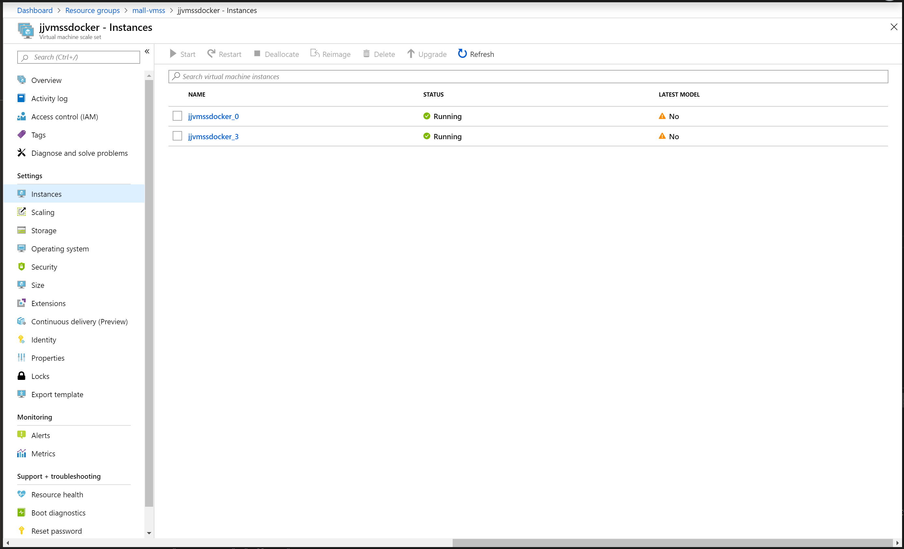

# Azure Virtual Machine ScaleSet running Docker container in custom virtual network
This script creates VMSS running Docker image stored in Azure Container Registry (ACR) in custom virtual network.

Using Docker Extension is deprecated ! see https://github.com/Azure/azure-docker-extension/wiki/Deprecation-Notice

We have to use custom script extension to install deploy it.

Script will deploy:
- VMSS Linux instances with custom script
- Internal load balancer
- Monitoring with Azure Monitor Log Analytics agent for Linux https://docs.microsoft.com/en-us/azure/virtual-machines/extensions/oms-linux

Azure Monitor Log Analytics workspace
- How to create https://docs.microsoft.com/en-us/azure/azure-monitor/learn/quick-create-workspace
- How to collect data https://docs.microsoft.com/en-us/azure/azure-monitor/platform/data-sources-syslog
- Get wokrspaceId and Key - Log Analytics resource -> Advanced settings

Note: Because we are using two extensions, you have to check if another install is running (see script).

## Deploy VMSS in virtual network with Azure CLI

You have to
- check script first, update password to Azure Container Repository and your docker image.
- update deployment parameters, password for VMSS, Log Analytics workspace

```sh
rg=<YOUR-NAME>
az group create -n $rg -l westeurope
az storage account create -l westeurope --sku "Standard_LRS" -g $rg -n jjstoragescript

./az-group-deploy.sh -g $rg -l westeurope -s jjstoragescript -a vmss-docker-myvnet
```

## Upgrade cluster
Now go to Azure Portal and check Instances. There is waiting update, click Upgrade. Our VMSS is configured as Manual upgrade.


