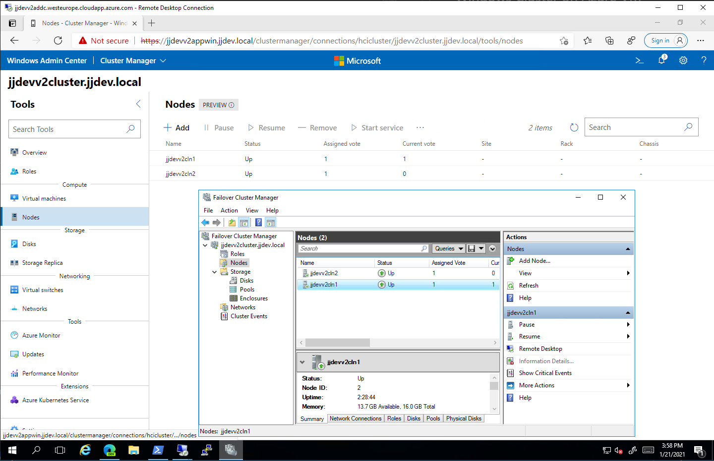

# Windows Cluster on Azure Virtual Machines

## Deploy Azure Virtual Machines

Prereq

- Existing Windows Active Directory Domain
- Existing Azure Virtual Network

Run [deploy.ps1](deploy.ps1).

Notes

- select proper Azure VM type supporting nested virtualization (not B series)

## Install Windows Cluster

Using Windows Admin Center

Create new Cluster type of Virtual Machines
- add two nodes jjdevv2cl1 and jjdevv2cl2
- join to Windows Active Directory Domain
- create network - make sure modify HyperV MAC address scope to reflect MAC of Azure NIC adapter
- create cluster - jjdevv2cluster.jjdev.local

